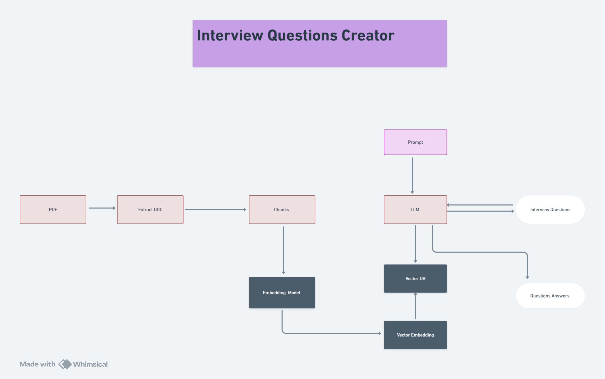

# Question Creator Application

## Overview
The Question Creator Application is a powerful tool designed to streamline the process of generating questions and answers from PDF documents. By leveraging OpenAI's GPT-3.5-turbo language model and FastAPI, this application provides an efficient solution for educators, students, interviewers, and anyone in need of automated question generation.

### Key Features

- **PDF Upload**: Users can easily upload PDF documents through a user-friendly web interface. The application accepts PDF files of various formats and sizes, ensuring flexibility for different use cases.
- **Automatic Question Generation**: The application utilizes the advanced capabilities of OpenAI's GPT-3.5-turbo model to analyze the content of the uploaded PDF and generate relevant questions. This feature is particularly useful for creating quizzes, study guides, and interview questions.
- **Answer Generation**: In addition to generating questions, the application also provides corresponding answers. This ensures a comprehensive understanding of the document content and facilitates learning and assessment.
- **CSV Export**: The generated questions and answers can be exported to a CSV file, allowing users to easily access, edit, and share the content. This feature is ideal for educators who want to distribute study materials or for interviewers preparing for candidate assessments.

### Use Cases

- **Educational Institutions**: Teachers and educators can use the application to quickly generate quizzes and study guides from textbooks and lecture notes.
- **Students**: Students can upload their course materials and generate practice questions to aid in exam preparation.
- **Interviewers**: HR professionals and interviewers can create interview questions from company documents or candidate resumes.
- **Content Creators**: Writers and content creators can generate discussion questions and comprehension checks for their articles and publications.

### Technical Overview

The application is built using FastAPI, a modern and fast web framework for building APIs with Python. FastAPI provides high performance, easy-to-use features, and automatic interactive API documentation, making it an ideal choice for this project.

The core functionality of question and answer generation is powered by OpenAI's GPT-3.5-turbo model. The application processes the uploaded PDF, extracts text content, and uses the language model to generate relevant questions and answers. The results are then formatted and made available for export as a CSV file.

### Application Flow Control

The flow of the application can be visualized as follows:

1. **User Uploads PDF**: The user uploads a PDF document through the web interface.
2. **Text Extraction**: The application extracts text content from the uploaded PDF.
3. **Question Generation**: The extracted text is processed by the GPT-3.5-turbo model to generate questions.
4. **Answer Generation**: The application generates corresponding answers for the questions.
5. **CSV Export**: The questions and answers are compiled into a CSV file, which the user can download.

### Conclusion

The Question Creator Application offers a robust and efficient solution for generating questions and answers from PDF documents. Its combination of advanced language model capabilities and easy-to-use interface makes it an invaluable tool for various user groups, enhancing learning, assessment, and content creation processes.

## Demo Video
[](link_to_demo_video)

## Application Flow Control
The flow control of the application can be visualized using the following diagram:



## Frameworks and Tools

### FastAPI
FastAPI is used in this project to create high-performance APIs for production environments. It is known for its speed, ease of use, and ability to generate automatic documentation.

## Getting Started

To get started with the project, follow these steps:

1. **Clone the repository:**
    ```sh
    git clone https://github.com/chuck-ankit/LLM.git
    cd Project/Interview-Questions-Creator
    ```

2. **Set up a virtual environment:**
    For Windows
    ```sh
    python -m venv venv
    source venv/bin/activate  # On Windows use `venv\Scripts\activate`
    ```
    For Linux:
    ```sh
    python3 -m venv .venv
    source .venv/bin/activate
    ```

3. **Install dependencies:**
    ```sh
    pip install -r requirements.txt
    ```

4. **Run the application:**
    ```sh
    python app.py
    ```

## Contribution Guidelines

If you wish to contribute to this project, please follow these steps:

1. Fork the repository.
2. Create a new branch (`git checkout -b feature/your-feature`).
3. Make your changes and commit them (`git commit -am 'Add your feature'`).
4. Push to the branch (`git push origin feature/your-feature`).
5. Create a new Pull Request.

## License

This project is licensed under the MIT License - see the [LICENSE](LICENSE) file for details.

